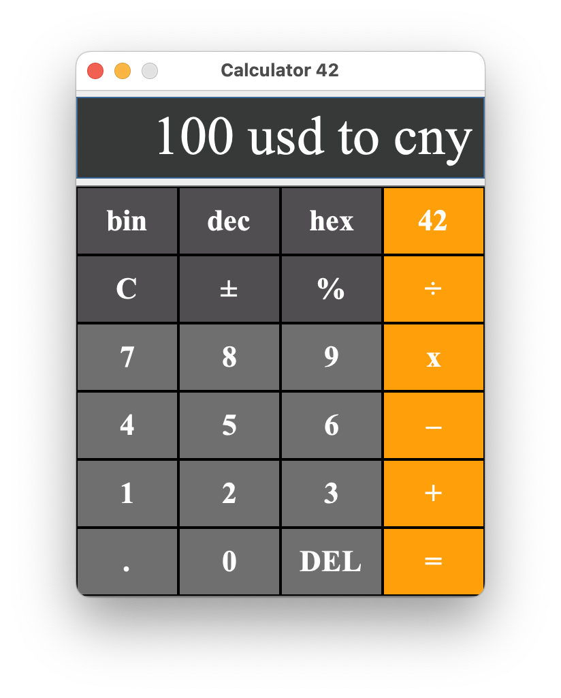

### Calculator-42
仿 macOS 风格 Java 实现的计算器

#### 参考资料
[java计算器程序_哔哩哔哩](https://www.bilibili.com/video/BV1d54y1s7uC)  
[Java better way to delete file if exists - Stack Overflow](https://stackoverflow.com/questions/27599965/java-better-way-to-delete-file-if-exists)  
[java - Newline in JLabel - Stack Overflow](https://stackoverflow.com/a/4933420/8172264)  
[How to get list of font names from Java - Stack Overflow](https://stackoverflow.com/questions/28787157/how-to-get-list-of-font-names-from-java)  
[java - how to hide the insert caret in a JTextField? - Stack Overflow](https://stackoverflow.com/a/34786353/8172264)  
[java - Set Border Thickness on JPanels? - Stack Overflow](https://stackoverflow.com/questions/29778456/set-border-thickness-on-jpanels)  
[java - How to I obtain the value of the environment variables? - Stack Overflow](https://stackoverflow.com/questions/4906292/how-to-i-obtain-the-value-of-the-environment-variables)  
[java - Setting background color for a JFrame - Stack Overflow](https://stackoverflow.com/a/4906550/8172264)  
[Java Swing - JOptionPane showMessageDialog example - Mkyong.com](https://mkyong.com/swing/java-swing-how-to-make-a-simple-dialog/)  
[How to Make Dialogs (The Java™ Tutorials > Creating a GUI With Swing > Using Swing Components)](https://docs.oracle.com/javase/tutorial/uiswing/components/dialog.html)  
[Resize ImageIcon (Swing / AWT / SWT forum at Coderanch)](https://coderanch.com/t/331731/java/Resize-ImageIcon)  
[swing - Java: Custom Buttons in showInputDialog - Stack Overflow](https://stackoverflow.com/questions/13334198/java-custom-buttons-in-showinputdialog)  
[Open URL in Java to get the content - Stack Overflow](https://stackoverflow.com/questions/9977221/open-url-in-java-to-get-the-content)  
[Java Program to Open Input URL in System Default Browser in Windows - GeeksforGeeks](https://www.geeksforgeeks.org/java-program-to-open-input-url-in-system-default-browser-in-windows/)  
[java - .setBackgroundColor with Hex Color Codes AndroidStudio - Stack Overflow](https://stackoverflow.com/questions/25837449/setbackgroundcolor-with-hex-color-codes-androidstudio)  
[JTextField: addFocusListener(FocusListener l) : JTextField javax.swing Java by API](http://www.java2s.com/Code/JavaAPI/javax.swing/JTextFieldaddFocusListenerFocusListenerl.htm)   
[swing - Copying text to the clipboard using Java - Stack Overflow](https://stackoverflow.com/questions/6710350/copying-text-to-the-clipboard-using-java)   
[hash - How to call a method stored in a HashMap? (Java) - Stack Overflow](https://stackoverflow.com/questions/4480334/how-to-call-a-method-stored-in-a-hashmap-java)  
[function - How to make a hashmap of dynamic methods in Java - Stack Overflow](https://stackoverflow.com/questions/50669922/how-to-make-a-hashmap-of-dynamic-methods-in-java)  
[How can I map a String to a function in Java? - Stack Overflow](https://stackoverflow.com/questions/2745796/how-can-i-map-a-string-to-a-function-in-java)  
[Can I map a String to a method in java? - Stack Overflow](https://stackoverflow.com/questions/6721318/can-i-map-a-string-to-a-method-in-java)  
[java - adding multiple entries to a HashMap at once in one statement - Stack Overflow](https://stackoverflow.com/questions/8261075/adding-multiple-entries-to-a-hashmap-at-once-in-one-statement)  
[Java 消除 if else 代码的几种方式 | 程序员技术之旅](https://www.zhangbj.com/p/793.html)  
[Using Map and HashMap in Java](https://www.vogella.com/tutorials/JavaMap/article.html)  
[How to Use Key Bindings (The Java™ Tutorials > Creating a GUI With Swing > Using Other Swing Features)](https://docs.oracle.com/javase/tutorial/uiswing/misc/keybinding.html)
[Java 杂记 表驱动法和 if-else，switch-case 优化 - JavaDev | 一如Java深似海](https://v_vincen.gitee.io/en/Java-%E6%9D%82%E8%AE%B0-%E8%A1%A8%E9%A9%B1%E5%8A%A8%E6%B3%95%E5%92%8C-if-else%EF%BC%8Cswitch-case-%E4%BC%98%E5%8C%96/)  
[js中如何优雅的替代 if-else - 掘金](https://juejin.cn/post/6993366068647460878)  
[枚举的常用姿势 (JAVA 为例) | LIXI.FUN](https://lixi.fun/2020/07/23/enum-commonly-used-java/)  
[Open a URL in Chrome using Java in Linux and MAC - Stack Overflow](https://stackoverflow.com/questions/45660482/open-a-url-in-chrome-using-java-in-linux-and-mac)  